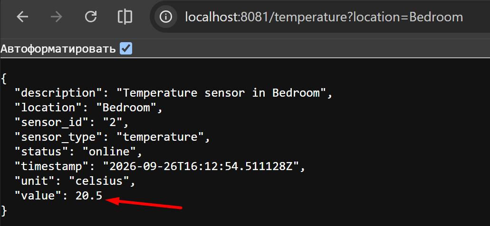
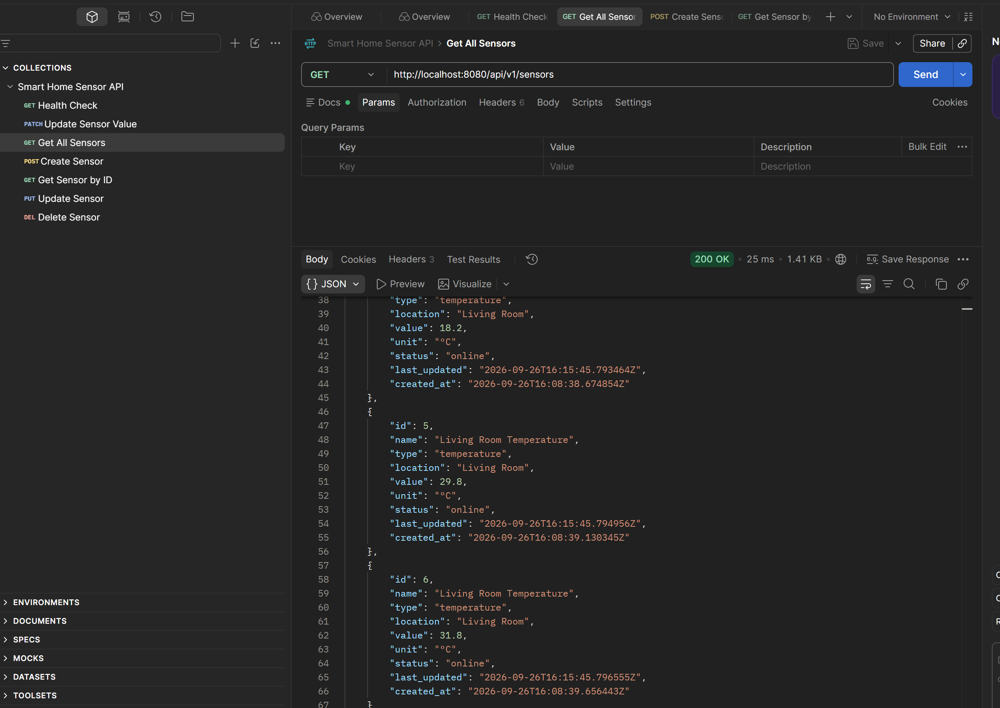

# Project_template

Это шаблон для решения проектной работы. Структура этого файла повторяет структуру заданий. Заполняйте его по мере работы над решением.

# Задание 1. Анализ и планирование

<aside>

Чтобы составить документ с описанием текущей архитектуры приложения, можно часть информации взять из описания компании и условия задания. Это нормально.

</aside>

### 1. Описание функциональности монолитного приложения

**Управление отоплением:**

- Пользователи могут удалённо включать/выключать отопление в своих домах.
- Система передаёт команды модулю отопления.

**Мониторинг температуры:**

- Пользователи могут просматривать текущую температуру в своих домах через веб-интерфейс.
- Сервер синхронно запрашивает показания датчиков и отображает их пользователю

### 2. Анализ архитектуры монолитного приложения

- Язык программирования: Go
- База данных: PostgreSQL
- Архитектура: Монолитная, все компоненты системы (обработка запросов, бизнес-логика, работа с данными) находятся в рамках одного приложения.
- Взаимодействие: Синхронное, запросы обрабатываются последовательно.
- Масштабируемость: Ограничена, так как монолит сложно масштабировать по частям.
- Развертывание: Требует остановки всего приложения.

### 3. Определение доменов и границы контекстов

- Домен - удаленное управление отоплением
- Контекст - управление отоплением отвечает за команды включить отключить отопление, хранит последнее состояние отопления и не отвечает за текущую температуру
- Контекст - получение информации о текущей температуре, хранит текущую температуру, и не отвечает за включение \ отключение отопления

- Домен - удаленное управление безопасностью\
- Контекст - управление автоматическими воротами, отвечает за команды открыть \ закрыть ворота\
- Контекст - управление видеонаблюдением. Отвечает за просмотр текущего видео

- Домен - управление освещением\
- Контекст - управление освещением отвечает за команды включить \ отключить освещение

- Вспомогательный домен - Управление Устройствами отвечает за регистрацию, подключение, настройку и интеграцию с оборудованием партнёров\
- Вспомогательный домен - пользователи и дома отвечает за права доступа пользователей, авторизацию и аутентификацию, и к какому дому привязан пользователь\
- Вспомогательный домен - Сценарии отвечает за сценарии автоматического управления устройствами. Определяет, когда должен сработать сценарий, и передаёт команду соответствующему контексту.  
### **4. Проблемы монолитного решения**

- Низкая надежность - все функции работают в одном процессе, поэтому ошибка, утечка памяти или исчерпание ресурсов может повлиять на всё приложение. Радиус отказа большой.
- Синхронные запросы:
   - вызывающий компонент ждёт ответа;
   - задержки зависимостей увеличивают общее время ответа;
   - сбой датчика или внешней системы может вызвать цепочку ошибок;
   - нет очереди, которая позволит временно сохранить команду и обработать её позже.
- Ограниченная масштабируемость. Нет возможности масштабировать отдельный сервис. В связи с чем лишние расходы
- Любое изменение требует пересборки, тестирования и развёртывания всего приложения. Это повышает риск изменений и замедляет выпуск новой версии продукта в продуктивную среду
- Тяжело поддерживать, увеличивается кодовая база, изменение одного компонента может задеть другой, требуется каждый раз полный регресс при тестировании, сложно работать 5 разработчикам в одном процессе.
- Добавление новых производителей и протоколов увеличивает кодовую базу монолита и может влиять на существующие интеграции

### 5. Визуализация контекста системы — диаграмма С4

[Контекстная диаграмма системы «Тёплый дом»](diagrams/context/warmhouse_context.puml)

# Задание 2. Проектирование микросервисной архитектуры

В этом задании вам нужно предоставить только диаграммы в модели C4. Мы не просим вас отдельно описывать получившиеся микросервисы и то, как вы определили взаимодействия между компонентами To-Be системы. Если вы правильно подготовите диаграммы C4, они и так это покажут.

**Диаграмма контейнеров (Containers)**

- [Диаграмма контейнеров](diagrams/container/warmhouse_container.puml)

**Диаграмма компонентов (Components)**

- [Сервис пользователей и доступа](diagrams/component/auth_service.puml)
- [Сервис управления и интеграции устройств](diagrams/component/device_service.puml)
- [Сервис ворот](diagrams/component/gate_service.puml)
- [Сервис отопления](diagrams/component/heating_service.puml)
- [Сервис освещения](diagrams/component/lighting_service.puml)
- [Сервис сценариев и автоматизации](diagrams/component/scenario_service.puml)
- [Сервис температуры](diagrams/component/temperature_service.puml)
- [Сервис видеонаблюдения](diagrams/component/video_service.puml)

**Диаграмма кода (Code)**

- [Диаграмма кода сервиса температуры](diagrams/code/temperature_service_code.puml)

# Задание 3. Разработка ER-диаграммы

- [логическая ER-диаграмма целевой системы](diagrams/ER/warmhouse_er.puml)

# Задание 4. Создание и документирование API

### 1. Тип API

Предлагается использовать REST API для микросервисов, так как это наиболее распространенный и понятный способ взаимодействия между сервисами. REST API позволяет легко интегрировать различные компоненты системы и обеспечивает гибкость в выборе технологий.
Для телеметрии, событий изменения состояния и надёжной доставки команд устройствам применяется асинхронный обмен через брокер сообщений. Это снижает временную связанность сервисов и позволяет обрабатывать временную недоступность устройств.

### 2. Документация API

- [Ссылка на документацию API для микросервисов](docs/api/warmhouse-api.yaml)

# Задание 5. Работа с docker и docker-compose

Написано простое приложение на python, temperature-api, которое будет имитировать работу удалённого датчика и при запросе /temperature?location= отдавать рандомное значение температуры

Приложение упаковано в Docker и использованием small образа python:3:12-slim и добавлено в docker-compose\
Проверка выполнена. При каждом вызове отображается разные значения температур
